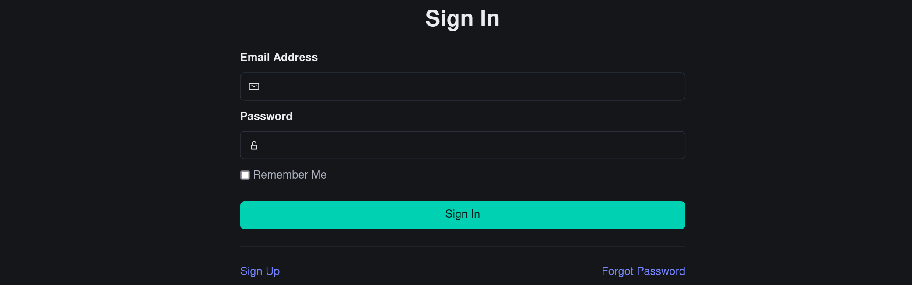
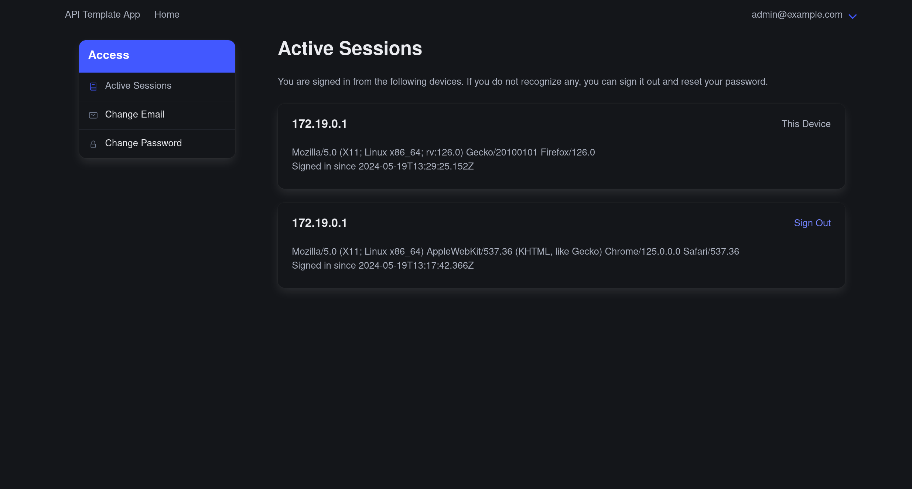

# API Template

This template repo is a starting point for a Ruby on Rails API with a Vue.js frontend.

## What's Included

### Development

* docker-compose configuration

### Backend

* Ruby on Rails
* Authentication (authentication-zero)
  * Email verification
  * Password reset
  * Session management
* Authorization (pundit)
* Background job processing (good_job)

### Frontend

* CSS Framework (bulma)
* Vue.js
* Pinia
* Custom validation framework
* Layouts
* `runQuery` and `runMutation`

## Getting Production Ready

* Setup mail (smtp or gem)

## Screenshots

